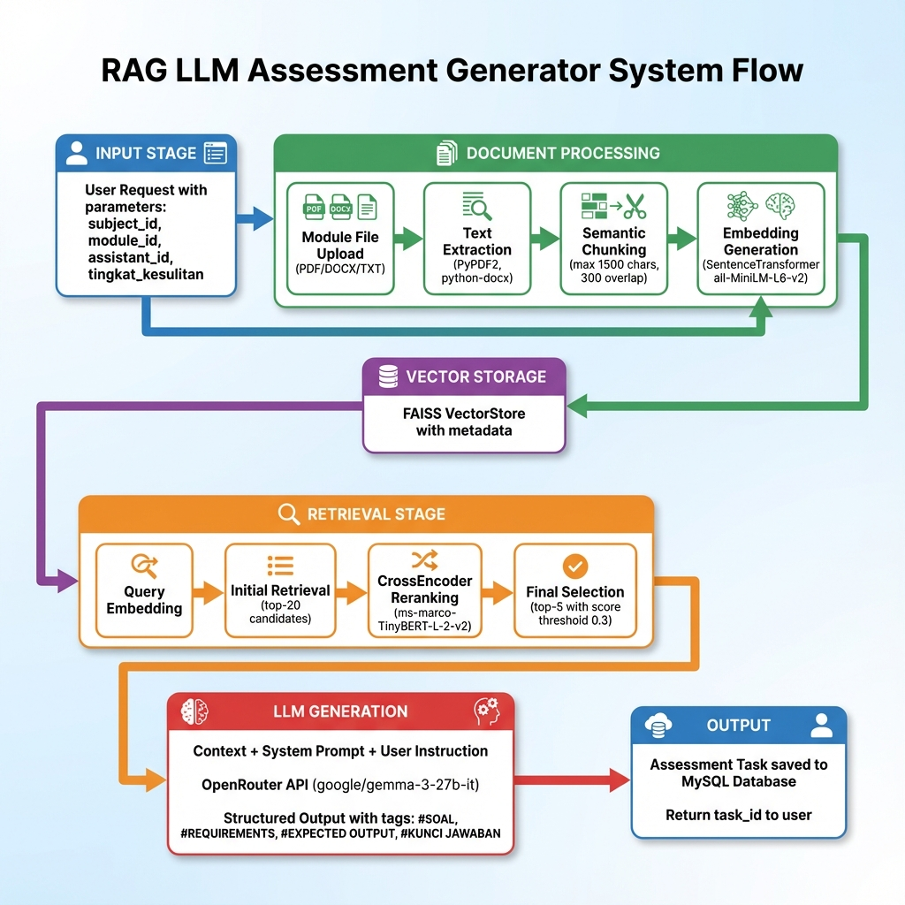

# 🎓 SI-LAB RAG Assessment Generator

[](https://www.python.org/)
[](https://flask.palletsprojects.com/)
[](LICENSE)

Sistem **Retrieval Augmented Generation (RAG)** untuk menghasilkan soal praktikum secara otomatis berdasarkan materi modul yang diunggah. Dikembangkan untuk SI-LAB (Sistem Informasi Laboratory).



---

## 📋 Daftar Isi

- [Fitur Utama](#-fitur-utama)
- [Arsitektur Sistem](#-arsitektur-sistem)
- [Teknologi yang Digunakan](#-teknologi-yang-digunakan)
- [Instalasi](#-instalasi)
- [Konfigurasi](#-konfigurasi)
- [Penggunaan API](#-penggunaan-api)
- [Struktur Project](#-struktur-project)
- [Dokumentasi](#-dokumentasi)

---

## ✨ Fitur Utama

| Fitur | Deskripsi |
|-------|-----------|
| 📄 **Multi-Format Support** | Mendukung PDF, DOCX, dan TXT sebagai sumber modul |
| 🔍 **Semantic Chunking** | Memecah dokumen dengan mempertimbangkan struktur semantik |
| 🧠 **Two-Stage Retrieval** | Initial retrieval + CrossEncoder reranking untuk presisi tinggi |
| 🤖 **LLM Generation** | Menghasilkan soal terstruktur dengan format standar |
| 📚 **Multi-Subject** | Mendukung berbagai mata kuliah (Python, Web, SQL, Java, Mobile) |
| 💾 **Caching** | VectorStore disimpan ke disk untuk reuse |
| 🔄 **Preview Mode** | Preview hasil sebelum menyimpan ke database |

---

## 🏗 Arsitektur Sistem

```
┌─────────────────────────────────────────────────────────────────┐
│                         USER REQUEST                             │
│         (subject_id, module_id, assistant_id, notes)            │
└─────────────────────────────┬───────────────────────────────────┘
                              ▼
┌─────────────────────────────────────────────────────────────────┐
│                      FLASK API LAYER                             │
│                     (routes/rag_routes.py)                       │
└─────────────────────────────┬───────────────────────────────────┘
                              ▼
┌─────────────────────────────────────────────────────────────────┐
│                    DOCUMENT PROCESSING                           │
│  ┌──────────┐  ┌──────────┐  ┌──────────┐  ┌──────────────────┐ │
│  │Extractor │→ │ Chunker  │→ │ Embedder │→ │   VectorStore    │ │
│  │PDF/DOCX  │  │ Semantic │  │MiniLM-L6 │  │     (FAISS)      │ │
│  └──────────┘  └──────────┘  └──────────┘  └──────────────────┘ │
└─────────────────────────────┬───────────────────────────────────┘
                              ▼
┌─────────────────────────────────────────────────────────────────┐
│                    RETRIEVAL + RERANKING                         │
│  ┌────────────────┐  ┌─────────────────┐  ┌──────────────────┐  │
│  │ Query Embedding│→ │ Initial Top-20  │→ │ CrossEncoder     │  │
│  │                │  │ FAISS Search    │  │ Rerank → Top-5   │  │
│  └────────────────┘  └─────────────────┘  └──────────────────┘  │
└─────────────────────────────┬───────────────────────────────────┘
                              ▼
┌─────────────────────────────────────────────────────────────────┐
│                      LLM GENERATION                              │
│  ┌─────────────────────────────────────────────────────────┐    │
│  │ Context + System Prompt + User Instruction → OpenRouter │    │
│  │                (google/gemma-3-27b-it)                  │    │
│  └─────────────────────────────────────────────────────────┘    │
└─────────────────────────────┬───────────────────────────────────┘
                              ▼
┌─────────────────────────────────────────────────────────────────┐
│                         OUTPUT                                   │
│    #SOAL | #REQUIREMENTS | #EXPECTED OUTPUT | #KUNCI JAWABAN    │
│                    → MySQL Database                              │
└─────────────────────────────────────────────────────────────────┘
```

---

## 🛠 Teknologi yang Digunakan

### Backend
| Komponen | Teknologi | Versi |
|----------|-----------|-------|
| Web Framework | Flask | 3.0+ |
| Database | MySQL | 8.0+ |
| ORM | PyMySQL | 1.1+ |

### RAG Pipeline
| Komponen | Teknologi | Deskripsi |
|----------|-----------|-----------|
| Text Extraction | pypdf, python-docx | Ekstraksi dari PDF & DOCX |
| Embedding Model | sentence-transformers | all-MiniLM-L6-v2 (384 dim) |
| Vector Store | FAISS | Facebook AI Similarity Search |
| Reranker | CrossEncoder | ms-marco-TinyBERT-L-2-v2 |

### LLM
| Komponen | Teknologi | Deskripsi |
|----------|-----------|-----------|
| Provider | OpenRouter | API Gateway untuk LLM |
| Model | google/gemma-3-27b-it | Model default |
| Fallback | Configurable | Via environment variable |

---

## 📦 Instalasi

### Prerequisites

- Python 3.10+
- MySQL 8.0+
- pip (Python package manager)

### Langkah Instalasi

1. **Clone repository**
   ```bash
   git clone https://github.com/username/RAG-LLM-ASSESSMENT.git
   cd RAG-LLM-ASSESSMENT
   ```

2. **Buat virtual environment**
   ```bash
   python -m venv venv
   
   # Windows
   venv\Scripts\activate
   
   # Linux/Mac
   source venv/bin/activate
   ```

3. **Install dependencies**
   ```bash
   pip install -r requirements.txt
   ```

4. **Setup database**
   ```bash
   python setup_database.py
   ```

5. **Jalankan aplikasi**
   ```bash
   python main.py
   ```

   Server akan berjalan di `http://localhost:5002`

---

## ⚙️ Konfigurasi

Buat file `.env` di root directory:

```env
# Database Configuration
MYSQL_HOST=localhost
MYSQL_PORT=3306
MYSQL_USER=root
MYSQL_PASSWORD=your_password
MYSQL_DB=silab_db

# LLM Configuration
OPENROUTER_API_KEY=your_openrouter_api_key
LLM_MODEL=google/gemma-3-27b-it:free

# Hugging Face (optional, untuk model private)
HUGGINGFACE_HUB_TOKEN=your_hf_token
```

---

## 🚀 Penggunaan API

### Generate Assessment

```http
POST /api/rag/generate
Content-Type: application/json

{
    "subject_id": 1,
    "module_id": 5,
    "assistant_id": 202,
    "tingkat_kesulitan": "Sedang",
    "notes": "Fokus pada materi loop dan array"
}
```

**Response:**
```json
{
    "status": "success",
    "message": "Assessment berhasil dibuat.",
    "task_id": 123,
    "processing_time_seconds": 45.2
}
```

### Upload Module

```http
POST /api/rag/upload-module
Content-Type: multipart/form-data

file: [PDF/DOCX/TXT file]
session_id: 1
title: "Modul Praktikum Python - Loop"
assistant_id: 202
```

### Get Subjects

```http
GET /api/rag/subjects
```

### Get Modules by Subject

```http
GET /api/rag/subjects/{subject_id}/modules
```

### Generation History

```http
GET /api/rag/generation-history/{subject_id}
```

---

## 📁 Struktur Project

```
RAG-LLM-ASSESSMENT/
├── main.py                 # Entry point Flask app
├── setup_database.py       # Database index setup
├── requirements.txt        # Python dependencies
├── .env                    # Environment variables
│
├── rag/                    # RAG Pipeline
│   ├── __init__.py
│   ├── extractor.py        # Text extraction (PDF, DOCX, TXT)
│   ├── chunker.py          # Semantic text chunking
│   ├── embedder.py         # Sentence embedding (MiniLM)
│   ├── vectorstore.py      # FAISS vector storage
│   ├── retriever.py        # Context retrieval + reranking
│   ├── reranker.py         # CrossEncoder reranker
│   ├── pipeline.py         # Main indexing pipeline
│   └── processor.py        # Legacy DB-based indexing
│
├── llm/                    # LLM Integration
│   ├── __init__.py
│   ├── client.py           # OpenRouter API client
│   └── generator.py        # Assessment prompt engineering
│
├── db/                     # Database
│   ├── __init__.py
│   ├── connection.py       # MySQL connection manager
│   └── generation_logger.py
│
├── routes/                 # API Routes
│   ├── __init__.py
│   └── rag_routes.py       # All RAG endpoints
│
├── assessment/             # Assessment Processing
│   ├── __init__.py
│   └── generator.py        # Assessment creation & storage
│
├── docs/                   # Documentation
│   ├── RAG_LLM_WALKTHROUGH.md
│   └── rag_llm_flowchart.png
│
├── upload/                 # Uploaded module files
└── cache/                  # Cached vectorstores
    └── vectorstores/
```

---

## 📖 Dokumentasi

Untuk dokumentasi teknis lengkap, lihat:

- 📄 [RAG LLM Walkthrough](docs/RAG_LLM_WALKTHROUGH.md) - Penjelasan alur sistem secara detail
- 📄 [Evaluation Integration](docs/EVALUATION_INTEGRATION.md) - Integrasi dengan sistem evaluasi

---

## 🎯 Mata Kuliah yang Didukung

| Mata Kuliah | Bahasa | Output Type |
|-------------|--------|-------------|
| Algoritma dan Pemrograman | Python | Console/Terminal |
| Pemrograman Website | HTML/CSS/JS/PHP | Halaman Web |
| Basis Data | SQL | Query Results |
| OOP JAVA | Java | Console Application |
| Pemrograman Mobile | Java (Android) | Screenshot UI |

---

## 📝 Format Output Assessment

LLM menghasilkan output terstruktur dengan tag:

```
#SOAL
[Judul dan deskripsi lengkap soal praktikum]

#REQUIREMENTS
1. [Requirement teknis 1]
2. [Requirement teknis 2]
3. [Requirement teknis 3]
...

#EXPECTED OUTPUT
```
[Contoh output program yang diharapkan]
```

#KUNCI JAWABAN
```python
[Source code lengkap sebagai jawaban referensi]
```
```

---

## 🤝 Kontribusi

1. Fork repository ini
2. Buat branch fitur (`git checkout -b feature/AmazingFeature`)
3. Commit perubahan (`git commit -m 'Add some AmazingFeature'`)
4. Push ke branch (`git push origin feature/AmazingFeature`)
5. Buat Pull Request

---

## 📄 Lisensi

Distributed under the MIT License. See `LICENSE` for more information.

---

## 👤 Author

**Mahendra** - Skripsi Project

- GitHub: [@Kyyneko](https://github.com/Kyyneko)

---

<p align="center">
  Made with ❤️ for SI-LAB
</p>
