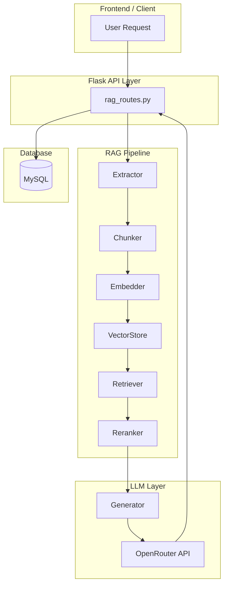
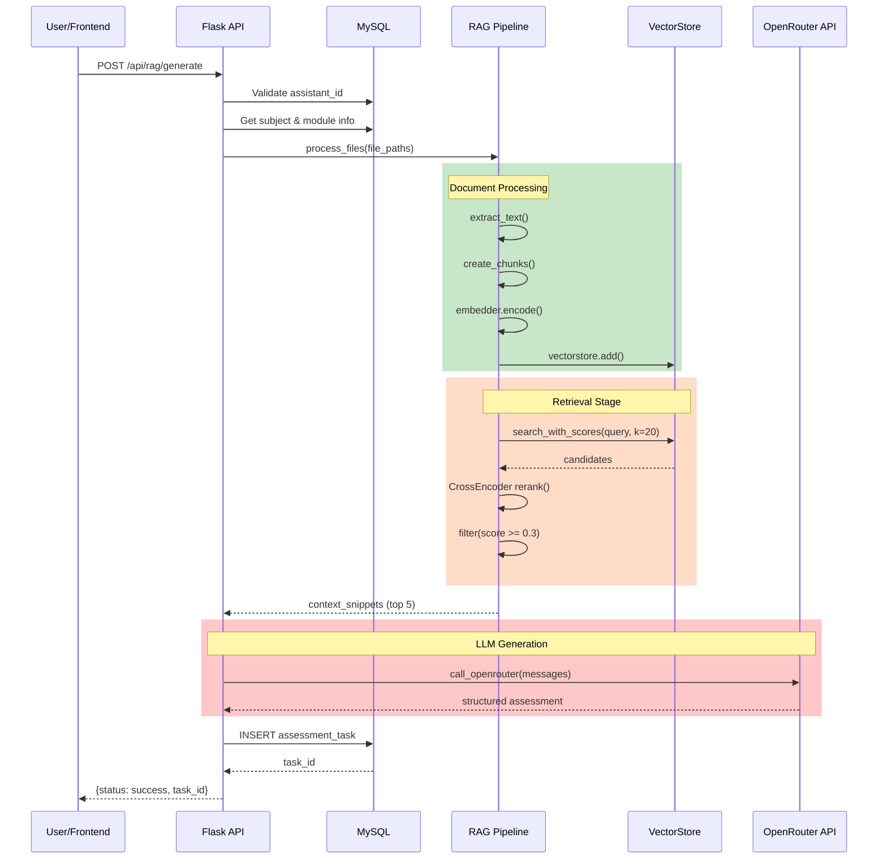

# Dokumentasi Alur RAG-LLM Assessment Generator

## Gambaran Umum Sistem

Sistem **SI-LAB RAG Assessment Generator** adalah aplikasi berbasis Flask yang memanfaatkan teknologi **Retrieval Augmented Generation (RAG)** untuk menghasilkan soal praktikum secara otomatis berdasarkan materi modul yang diunggah.


---

## Arsitektur Sistem



---

## Alur Proses Lengkap

### 🔵 TAHAP 1: Input Request

**Endpoint:** `POST /api/rag/generate`

**File:** [rag_routes.py](file:///d:/Mahendra/Kuliah/Skripsi/RAG-LLM-ASSESSMENT/routes/rag_routes.py)

User mengirimkan request dengan parameter:

| Parameter | Tipe | Deskripsi |
|-----------|------|-----------|
| `subject_id` | int | ID mata kuliah |
| `module_id` | int | ID modul yang akan dijadikan referensi |
| `assistant_id` | int | ID asisten lab yang membuat soal |
| `tingkat_kesulitan` | string | Level kesulitan: "Mudah", "Sedang", "Sulit" |
| `notes` | string | Catatan/instruksi tambahan (opsional) |

```python
# Contoh Request Body
{
    "subject_id": 1,
    "module_id": 5,
    "assistant_id": 202,
    "tingkat_kesulitan": "Sedang",
    "notes": "Fokus pada materi loop dan array"
}
```

---

### 🟢 TAHAP 2: Document Processing

#### 2.1 Text Extraction

**File:** [extractor.py](file:///d:/Mahendra/Kuliah/Skripsi/RAG-LLM-ASSESSMENT/rag/extractor.py)

Sistem mengekstrak teks dari file modul berdasarkan format:

| Format | Library | Fungsi |
|--------|---------|--------|
| PDF | `pypdf` | `extract_text_from_pdf()` |
| DOCX | `python-docx` | `extract_text_from_docx()` |
| TXT | built-in | `extract_text_from_txt()` |

```python
def extract_text(path: str) -> str:
    ext = path.lower()
    if ext.endswith(".pdf"):
        return extract_text_from_pdf(path)
    elif ext.endswith(".docx"):
        return extract_text_from_docx(path)
    elif ext.endswith(".txt"):
        return extract_text_from_txt(path)
```

#### 2.2 Semantic Chunking

**File:** [chunker.py](file:///d:/Mahendra/Kuliah/Skripsi/RAG-LLM-ASSESSMENT/rag/chunker.py)

Teks dipecah menjadi chunk dengan mempertimbangkan struktur semantik:

| Parameter | Nilai Default | Deskripsi |
|-----------|---------------|-----------|
| `max_chars` | 1500 | Maksimal karakter per chunk |
| `overlap` | 300 | Tumpang tindih antar chunk |

**Algoritma:**
1. Pecah teks berdasarkan paragraf (`\n\n`)
2. Jika paragraf terlalu panjang, pecah berdasarkan kalimat
3. Tambahkan overlap dari chunk sebelumnya untuk menjaga konteks

```python
def create_chunks(text: str, max_chars: int = 1500, overlap: int = 300):
    paragraphs = text.split('\n\n')
    # ... semantic splitting logic
    yield chunk
```

#### 2.3 Embedding Generation

**File:** [embedder.py](file:///d:/Mahendra/Kuliah/Skripsi/RAG-LLM-ASSESSMENT/rag/embedder.py)

Model: **`sentence-transformers/all-MiniLM-L6-v2`**

| Spesifikasi | Nilai |
|-------------|-------|
| Dimensi | 384 |
| Normalisasi | L2 |
| Pattern | Singleton |

```python
class Embedder:
    _instance = None
    _model = None
    
    def encode(self, texts) -> np.ndarray:
        vectors = self._model.encode(texts, normalize_embeddings=True)
        return np.array(vectors, dtype="float32")
```

---

### 🟣 TAHAP 3: Vector Storage

**File:** [vectorstore.py](file:///d:/Mahendra/Kuliah/Skripsi/RAG-LLM-ASSESSMENT/rag/vectorstore.py)

Menggunakan **FAISS (Facebook AI Similarity Search)** untuk menyimpan dan mencari vektor:

| Fitur | Deskripsi |
|-------|-----------|
| Index Type | `IndexFlatIP` (Inner Product / Cosine Similarity) |
| Metadata Tracking | Source file, subject_id, chunk_index |
| Caching | Save/load ke disk untuk reuse |

```python
class VectorStore:
    def __init__(self, dim: int):
        self.index = faiss.IndexFlatIP(dim)
        self.texts = []
        self.metadata = []
    
    def add(self, embeddings, texts, metadata):
        self.index.add(embeddings)
        self.texts.extend(texts)
        self.metadata.extend(metadata)
```

**Struktur Cache:**
```
cache/vectorstores/
├── subject_1.index    # FAISS index
├── subject_1.pkl      # Texts + metadata
├── subject_2.index
└── subject_2.pkl
```

---

### 🟠 TAHAP 4: Retrieval dengan Reranking

**File:** [retriever.py](file:///d:/Mahendra/Kuliah/Skripsi/RAG-LLM-ASSESSMENT/rag/retriever.py)

#### 4.1 Initial Retrieval

Query diubah menjadi embedding, lalu dicari **top-20 kandidat** terdekat:

```python
query_vec = embedder.encode([query])
candidates = vectorstore.search_with_scores(query_vec, initial_k=20)
```

#### 4.2 CrossEncoder Reranking

**File:** [reranker.py](file:///d:/Mahendra/Kuliah/Skripsi/RAG-LLM-ASSESSMENT/rag/reranker.py)

Model: **`cross-encoder/ms-marco-TinyBERT-L-2-v2`**

CrossEncoder memberikan scoring lebih akurat karena memproses query dan dokumen secara bersamaan:

```python
class CrossEncoderReranker:
    def rerank(self, query: str, documents: list[str], top_k: int):
        pairs = [[query, doc] for doc in documents]
        scores = self.model.predict(pairs)
        # Sort by score descending
        return sorted_results[:top_k]
```

#### 4.3 Final Selection

| Parameter | Nilai | Deskripsi |
|-----------|-------|-----------|
| `top_k` | 5 | Jumlah hasil akhir |
| `score_threshold` | 0.3 | Minimum relevance score |

```python
filtered = [cand for cand in candidates if cand["score"] >= 0.3]
results = filtered[:5]
```

---

### 🔴 TAHAP 5: LLM Generation

**File:** [generator.py](file:///d:/Mahendra/Kuliah/Skripsi/RAG-LLM-ASSESSMENT/llm/generator.py)

#### 5.1 Subject Configuration

Sistem mendeteksi konfigurasi berdasarkan mata kuliah:

| Mata Kuliah | Bahasa | Output Type |
|-------------|--------|-------------|
| Algoritma dan Pemrograman | Python | Console/Terminal |
| Pemrograman Website | HTML/CSS/JS/PHP | Halaman Web |
| Basis Data | SQL | Query Results |
| OOP JAVA | Java | Console Application |
| Pemrograman Mobile | Java (Android) | Screenshot UI |

#### 5.2 Prompt Construction

**System Message:**
- Aturan ketat untuk hanya menggunakan konsep yang ada di modul
- Format output wajib dengan tag

**User Message:**
- Informasi subject, topic, class
- Context snippets dari retrieval
- Custom notes jika ada

```python
messages = [
    {"role": "system", "content": system_prompt},
    {"role": "user", "content": user_instruction}
]
```

#### 5.3 API Call

**File:** [client.py](file:///d:/Mahendra/Kuliah/Skripsi/RAG-LLM-ASSESSMENT/llm/client.py)

| Setting | Nilai |
|---------|-------|
| Provider | OpenRouter API |
| Model | `google/gemma-3-27b-it:free` |
| Max Tokens | 8000 |
| Temperature | 0.7 |
| Retry Logic | Max 10 attempts dengan exponential backoff |

```python
def call_openrouter(messages, model=None, max_retries=10, timeout=120):
    payload = {
        "model": model_name,
        "messages": messages,
        "max_tokens": 8000,
        "temperature": 0.7,
    }
    response = requests.post(url, headers=headers, json=payload)
    return response.json()["choices"][0]["message"]["content"]
```

---

### 🔵 TAHAP 6: Output Processing

**File:** [assessment/generator.py](file:///d:/Mahendra/Kuliah/Skripsi/RAG-LLM-ASSESSMENT/assessment/generator.py)

#### 6.1 Output Format

LLM menghasilkan output terstruktur dengan tag:

```
#SOAL
[Judul dan deskripsi soal]

#REQUIREMENTS
1. [Requirement 1]
2. [Requirement 2]
...

#EXPECTED OUTPUT
```
[Contoh output program]
```

#KUNCI JAWABAN
```python
[Source code jawaban]
```
```

#### 6.2 Database Storage

Data disimpan ke tabel `assessment_task`:

| Column | Type | Deskripsi |
|--------|------|-----------|
| id | INT | Primary key |
| name | VARCHAR | Nama assessment |
| description | TEXT | Full LLM output |
| id_subject | INT | FK ke subject |
| created_by | INT | FK ke user (assistant) |
| created_at | TIMESTAMP | Waktu pembuatan |

```python
cur.execute("""
    INSERT INTO assessment_task (name, description, id_subject, created_by)
    VALUES (%s, %s, %s, %s)
""", (name, raw_output, subject_id, assistant_id))
task_id = cur.lastrowid
```

---

## Diagram Alur Lengkap



---

## Ringkasan Flow

| Stage | Komponen | Input | Output |
|-------|----------|-------|--------|
| 1 | API Route | HTTP Request | Validated params |
| 2 | Extractor | File path | Raw text |
| 3 | Chunker | Raw text | List of chunks |
| 4 | Embedder | Chunks | Vector embeddings |
| 5 | VectorStore | Embeddings | Indexed store |
| 6 | Retriever | Query | Top-20 candidates |
| 7 | Reranker | Candidates | Top-5 relevant |
| 8 | Generator | Context + Prompt | Structured assessment |
| 9 | Database | Assessment | task_id |

---

## Keunggulan Arsitektur

1. **Semantic Chunking**: Tidak memotong di tengah kalimat
2. **Two-Stage Retrieval**: Initial retrieval + CrossEncoder reranking untuk presisi lebih tinggi
3. **Caching**: VectorStore disimpan ke disk untuk reuse
4. **Strict Prompting**: LLM hanya menggunakan konsep yang ada di modul
5. **Multi-Subject Support**: Konfigurasi otomatis berdasarkan mata kuliah
6. **Retry Logic**: Penanganan rate limit dan error dengan exponential backoff
